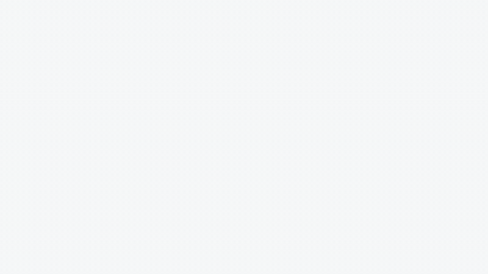

<p align="center">
  
</p>

<h2 align="center">begging-for-citations</h2>

<p align="center">
NIW / EB-1A green card toolkit — find the papers that should be citing you, and ask them to.
</p>

<p align="center">
<a href="#"></a>
&nbsp;
<a href="#"></a>
</p>

<p align="center">
  
</p>

<p align="center">
  <a href="assets/demo.mp4">▶ watch with sound</a>
</p>

---

## What it does

Your citation count is evidence USCIS weighs. This tool grows it, on autopilot:

1. **Scans** every new paper in your field (via [OpenAlex](https://openalex.org), the open index of 250M papers)
2. **Keeps** the ones that genuinely overlap your papers — preprints first, they're still editable
3. **Finds** each author's institutional email — one [Monid](https://monid.ai) call per author, server-side web search, verified against their affiliation
4. **Drafts** one personalized email per paper into your Gmail — it never sends; you review, you hit send

## Quickstart

```bash
git clone https://github.com/Jasper0122/begging-for-niw-eb1a-citation.git
cd begging-for-niw-eb1a-citation
pip install -r requirements.txt

python scripts/find_citations.py --name "Your Full Name"
```

Output lands in `data/output/`: a ranked tracker grouped by your papers, with an email draft per candidate. No API keys required.

## Claude Code (recommended)

Open this folder in [Claude Code](https://claude.ai/code) and run:

```
/niw-citation
```

The skill runs the pipeline, judges relevance from the abstracts, writes the overlap sentence in each email, and (with the Gmail connector, `/mcp` → **claude.ai Gmail**) creates the drafts for you.

**Set-and-forget:** run `/schedule` and ask for a daily routine pointing at this repo, with the **Gmail** and **[Monid](https://monid.ai)** connectors attached — Gmail is the state store (dedup against sent + drafts), Monid does the email lookups. Every day it scans, matches, finds emails, and drops fresh drafts into your Gmail. Your only job: review and hit send.

## Good to know

- Emails are found for roughly 20–40% of authors; ResearchGate is the fallback for the rest.
- Default similarity threshold is `--min-sim 0.45`; raise for a tighter list, lower for niche fields.

## Works best with

**[begging-for-recommenders](https://github.com/Jasper0122/begging-for-niw-eb1a-recommenders)** — the companion tool, same profile JSON. People who already cited you → recommendation letters. Papers that should cite you → this repo.

---

*The missing citations aren't missing because your work isn't relevant.*
*They're missing because those authors haven't found you yet.*
